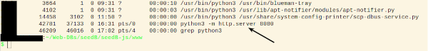

# seedB 

In development.

A seed database for people who collect and grow their own seeds.

Features for each record:

* Group
* Variety
* Packet ID (stored) unique record identifier
* Weight (seed)
* Count (seed)
* Cost (when bought / if bought)
* Date collected
* Timestamp for each edit of record

The software can be deployed in three different configurations of choice on a laptop and/or desktop computer:

* Progressive Web App (PWA).
* Local Area Network (LAN) Webserver on a Raspberry Py.
* Electron based for Linux and Android.

## PWA (Progressive Web Apps) Instructions

### Using Localhost

Instructions

Open terminal in the same directory as the index.html file.
Enter the following command `./localhost.sh` to start the Python3 webserver in the localhost:8080.

Use a Chrome (Chromium, SlimJet or any Chromium based browser) and type `localhost:8080` in the address bar.

## LAN Web Server Instructions

## Electron setup Instructions

Software developed using Ubuntu 20.04 and Electron.

### Nodejs setup

[NVM (Node Version Manager)](https://github.com/nvm-sh/nvm) used for deploying Nodejs during development. [Detailed installation instructions](https://github.com/nvm-sh/nvm?tab=readme-ov-file#installing-and-updating). LTS Nodejs used (node v20.16.0) (npm v10.8.1). Installed Long Term Support version used and installed:

    nvm install 20.16.0

Checking installation with the following commands:

    nvm use --lts
    node -v
    npm -v

In terminal open the directory `./www/electron` and check it has the configuration files `main.js` and `package.json` . Install Electron with the commands:

    nvm use --lts
    npm install --save-dev electron

Open seedB in Electron from within `./www/electron` with the command:

    npm start

## Cordova setup instructions

    cordova platform add browser
    cordova run browser

## for building/running android (linux-specific)

    export ANDROID_HOME="$HOME/DevTools/Android/"
    export ANDROID_SDK_ROOT="$HOME/DevTools/Android/"
    export JAVA_HOME=/usr/lib/jvm/default-java/
    PATH="$JAVA_HOME/bin:$ANDROID_HOME/cmdline-tools/latest/bin:$ANDROID_HOME/platform-tools:$PATH"
